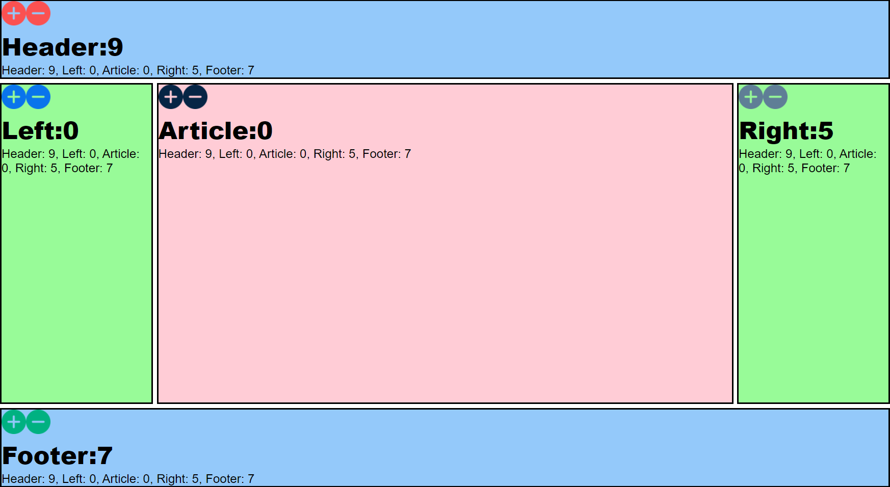

# Full-Stack Holy Grail Application

> Description/Motivation: 

This project is for educational purposes.
- [Holy grail (web design)](hhttps://en.wikipedia.org/wiki/Holy_grail_(web_design))

## Installation Guidelines:

Run `git clone https://github.com/Verson-tech/Full-Stack-Holy-Grail-Application---w-25.git`\
Run `npm install`\
Run `docker run -p 6379:6379 --name some-redis -d redis`\
Run `npm install express --save`\
Run `npm install redis`\
- Other usefull commands:
Run `docker ps`\
Run `node index.js`\

## Technology used:

- [HTML](https://developer.mozilla.org/en-US/docs/Web/HTML) - HTML: HyperText Markup Language
- [CSS](https://developer.mozilla.org/en-US/docs/Glossary/CSS) - CSS (Cascading Style Sheets) is a declarative language that controls how webpages look in the browser
- [NODE.js](https://nodejs.org/en/) - Node.js® is a JavaScript runtime built on Chrome's V8 JavaScript engine.
- [Express](https://expressjs.com/) - Fast, unopinionated, minimalist web framework for Node.js
- [docker](https://www.docker.com/) - Docker takes away repetitive, mundane configuration tasks and is used throughout the development lifecycle for fast, easy and portable application development - desktop and cloud. Docker’s comprehensive end to end platform includes UIs, CLIs, APIs and security that are engineered to work together across the entire application delivery lifecycle
- [redis](https://robomongo.org/) - Redis is an open source (BSD licensed), in-memory data structure store, used as a database, cache, and message broker

## Features:

- An app with synchronized communication between the client, server, and data store
- Future improvments: This project is for educational purposes.